# Desert Frost Spice
**currently only Engine ;)**

<div align="center">

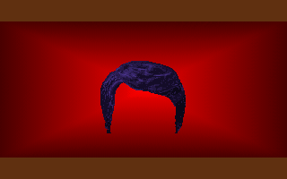

</div>

## Rebuilding Cryo's *Dune* (1992)

Desert Frost is a new native [ScummVM](https://www.scummvm.org/) engine for
Cryo Interactive's *Dune*. Its goal is to make the game portable to modern
systems, including iOS. One build detects and plays all four releases: the
DOS floppy and CD, the **Amiga** and the **Sega CD / Mega CD**.

The project works from legally obtained game data. No copyrighted Dune game
executables, archives, music files, or disc images are redistributed here.

<div align="center">

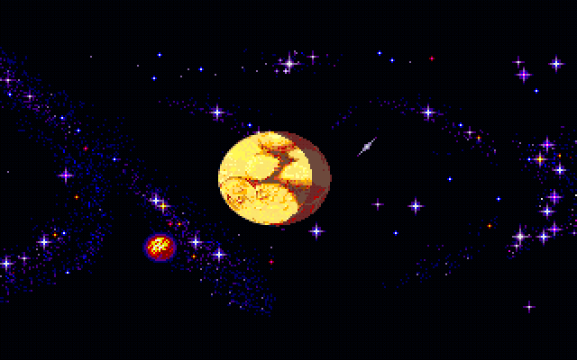

<br>
<em>Native ScummVM desktop dump of the reconstructed opening sequence.</em>

</div>

## Building

Short version (details, the macOS scripts, the regression harness and the iOS
package are in **[BUILDING.md](BUILDING.md)**):

```sh
git clone https://github.com/scummvm/scummvm.git && cd scummvm
git checkout 430653b98d75e86d15a293c0aa3b3dbed56b499d   # tested ScummVM commit
cp -R ../desert-frost-engine/third_party/scummvm/engines/dune engines/dune
./configure --disable-all-engines --enable-engine=dune && make -j8
./scummvm --path=/path/to/your/dune-data dune
```

The data directory needs the game's executable next to the data: `DUNE.DAT` +
`DNCDPRG.EXE` for the CD release, the loose `*.HSQ` files + `DUNEPRG.EXE` for
the floppy release. For the Amiga, extract the three disk images with
`scripts/dune_amiga_extract.py`; for the Sega CD, point ScummVM at the folder
with the disc's bin/cue rip. [BUILDING.md](BUILDING.md#game-data) has the
details.

## Current state of the engine

This is a development build, not an end-user release yet. The DOS floppy and
CD releases play from the intro to the ending; the Amiga and Sega CD ports are
younger (see their rows). The table shows what works; the full status is in
[`engines/dune/README.md`](third_party/scummvm/engines/dune/README.md).

| Area | State |
| --- | --- |
| Resources | `DUNE.DAT` archive, loose floppy files, HSQ compression |
| Graphics | 4-bit/8-bit sprite sheets, `.SAL` rooms, sky and sand colours by time of day and day of the week (WAIT FOR EVENING/MORNING with the original's spiral and blend), the vision dream screen, Paul's head on the panel turning away as in the original, the original control panel (with the companions travelling with Paul), font and pointer |
| Intro | CD: the videos in the executable's own order, with Irulan's narration and subtitles, the MTG1-3 flyovers, the story scenes and PLANT; floppy: all 33 scenes, credits and the narrated prologue |
| World | places, room tables, exits and characters read from the game's executable; palace, sietches, villages and fortresses; characters on the markers the executable assigns |
| Dialogue and book | the original dialogue engine (conditions, actions, talking portraits) and Paul's book |
| Map | the flat map with the places' icons and original-style labels, the original DUNE MAP popup, map menu and planet panel, travel (with the CD's flight and arrival videos), and the globe with the game menu |
| Saves | save and load in the original `DUNE21S?.SAV` / `DUNE37S?.SAV` format |
| Sound | HERAD AdLib music through ScummVM's OPL emulator |
| iOS | direct touch, the audio-session fix, ad-hoc-signed IPA builds |
| Gameplay | the game clock, flight, hiring Fremen troops (WORK FOR ME) and giving them orders, the prospector lesson and MOVE TROOP with the spice-density popup, GO & SEARCH FOR EQUIPMENT, the palace plan, people standing where the original's per-landing rotation puts them, spice harvest and prospecting, rallying (charisma), the results screen, all following the executable's rules ([gameplay-rules.md](notes/research/gameplay-rules.md)) |
| Story | story phases and their callbacks, Jessica's lessons, the Emperor's spice demands bargained with Duncan in the COMM room, Paul's visions, the scripted scenes, the sietch chiefs' story lines (the stillsuit maker) and Stilgar's Water of Life (the blackout, three periods, Stilgar's wake-up line) |
| Ecology and ending | the ecology route (wind traps, bulbs, irrigation, vegetation spreading on the map, fortresses taken, MODIFY EQUIPMENT), the ecology win (vegetation takes the forts; the final attack), the Harkonnen zone, deaths on arrival, the final scene, and playing on after the final battle |
| Desert and flight | walking in the desert with its landscape, the ornithopter cockpit and destination screen, steering in free flight, CHANGE DESTINATION, the flight landscape (seeded row by row as the original, checked against its memory) and sightings of companions |
| War and the ending | troop marches and espionage, fort battles, MASSIVE ATTACK and FIGHT FOR A WHOLE DAY, the Harkonnen captain, worm riding, the smugglers' village and their trade (offers, ARGUE / ACCEPT / REFUSE, bills paid through Duncan), Harkonnen saboteurs and worm attacks on harvesters, the Fremen epidemic cured by Chani, Chani's kidnapping and rescue, the quarrel between north and south troops (as in the original: mixed troops stop working) and the final attack on the Harkonnen palace |
| Amiga | plays on the shared engine: its files, sheets, rooms, 32-colour palettes, copper sky and data segment are converted to the DOS layouts on load. Rooms, dialogue, map, globe, book, mirror, flights and the story screens work. Not ported yet: the intro (the game opens in the throne room), music and sound, and the desert landscape (walks and flights show plain sky over sand) |
| Sega CD / Mega CD | its own host: the disc's index, text, tile screens and initial game data, the original room screens, panel, conversations with portraits, and the map with travel. Not yet: verbs, videos, sound, flight and battles. The Mega CD (Europe) entry is detected but untested |
| Not yet | full command lists per room |

`scripts/check_speedrun.sh` lets a bot play the known PC speedrun route through
the engine's own actions and checks that it reaches the Emperor's throne room
(the route is in [`notes/speedrun/route.md`](notes/speedrun/route.md)). It plays from a new game to
the ending on both the floppy and the CD release.

The reverse-engineering record, with a source and confidence for each fact, is
in [`FINDINGS.md`](third_party/scummvm/engines/dune/FINDINGS.md).

## Game options

Options that change the original's behaviour are **off by default**, so the
engine plays as the original does. Turn them on per game in ScummVM's
**Options > Engine** tab (desktop and iPhone), or in `scummvm.ini` under the
game's section. ScummVM's command line cannot pass engine-specific settings,
so there is no command-line switch.

The options are offered for the DOS floppy and CD releases. A game entry added
to ScummVM by an older build shows the checkboxes only after Dune has been
started once, because ScummVM refreshes the entry's stored options when the
game starts.

| Option | `scummvm.ini` key | What it does |
| --- | --- | --- |
| Fix the Leto loop | `dune_fix_leto_loop=true` | Duke Leto is gone from every room after his death (see below) |
| Fix Celimyn-Tuek | `dune_fix_celimyn_tuek=true` | The sietch Celimyn-Tuek can be found from story stage 0x58 on (see below) |

### The Leto loop

**The cause.** When Leto dies, the original game never updates his own
record, which still places him in the throne room. So the game keeps finding
him there, drawing him, listing him and letting him talk. By default the
engine keeps that behaviour, to stay faithful to the original.

**How to turn the fix on** (off by default):

- In ScummVM: the Dune game's **Options > Engine**, tick **Fix the Leto loop**.
  It is the same on desktop and iPhone.
- Or add `dune_fix_leto_loop=true` under the game's section in `scummvm.ini`.

With the fix on, Leto is no longer drawn, listed or talking after his death.
The rest of the story is unchanged, including the handover to Duncan and the
final scene with the Emperor. `scripts/check_leto_loop.sh` checks both
settings.

### Celimyn-Tuek

**The cause.** Each hidden place has a byte for the story stage from which it
can be found. The original's starting data gives the sietch Celimyn-Tuek 0xff,
a stage the story never reaches, so it is never found. By default the engine
keeps that behaviour.

**How to turn the fix on** (off by default): tick **Fix Celimyn-Tuek** in the
game's **Options > Engine**, or add `dune_fix_celimyn_tuek=true` to
`scummvm.ini`. The byte becomes 0x58 in memory at new game and after a load;
a save file changes only when the game saves. `scripts/check_celimyn_tuek.sh`
checks both settings.

## Screenshots

Captured from the current engine (desktop SDL build) with the original DOS
data; the iOS build draws the same frames.

<div align="center">

| | |
| --- | --- |
| 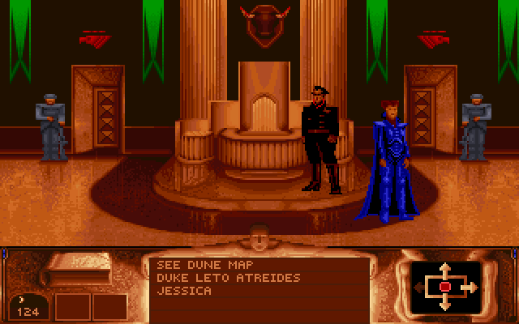 | 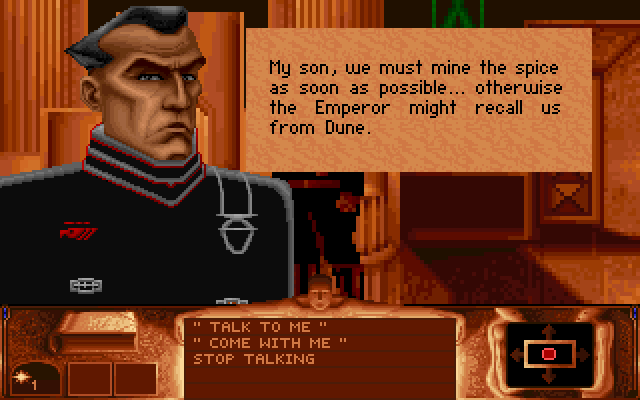 |
| Throne room: Duke Leto and Jessica | Dialogue with a talking portrait |
| 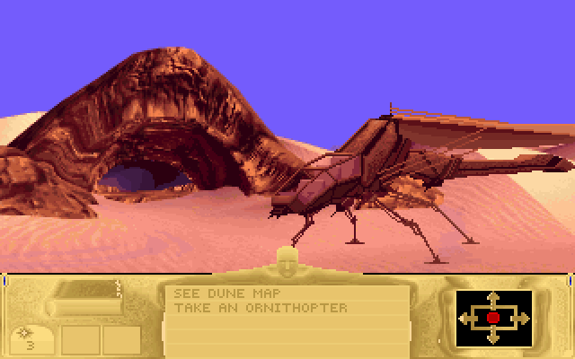 | 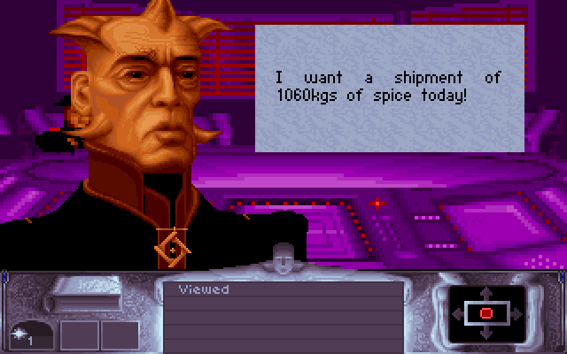 |
| Arriving at a sietch (CD release) | The Emperor's spice demand in the COMM room |
| 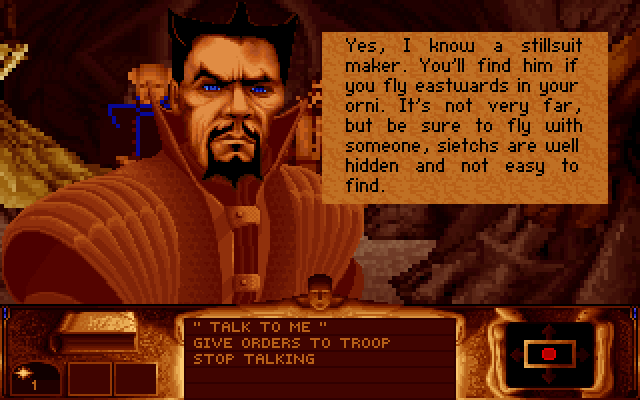 | 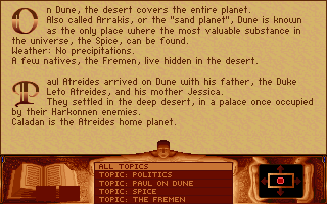 |
| A sietch chief and the stillsuit chain | Paul's book |
| 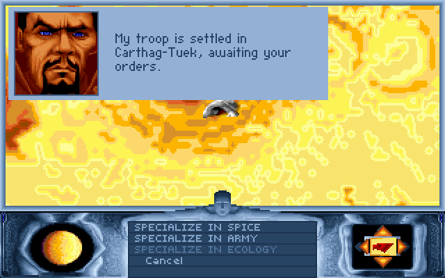 | 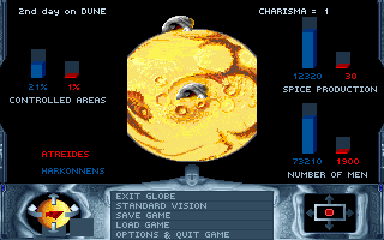 |
| Giving orders to a Fremen troop | The results screen |

</div>

### Amiga and Sega CD

<div align="center">

| | |
| --- | --- |
| 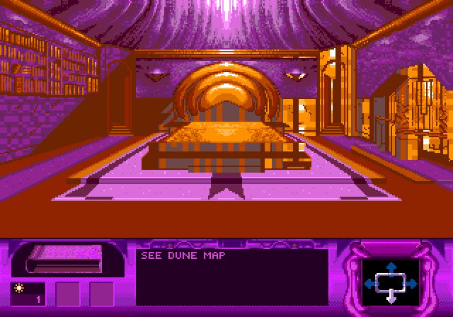 | 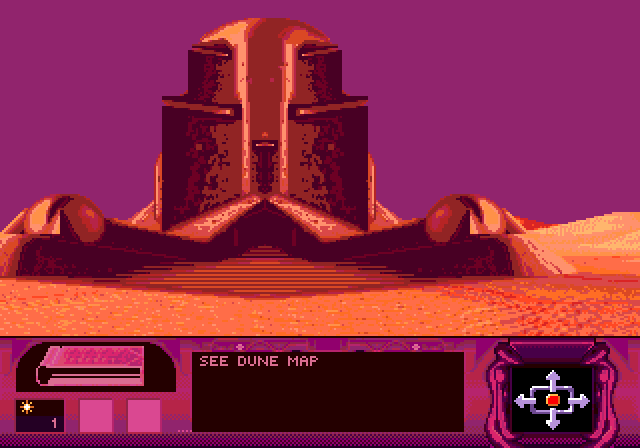 |
| Sega CD: a palace room with its own panel | Sega CD: a sietch outside |
| 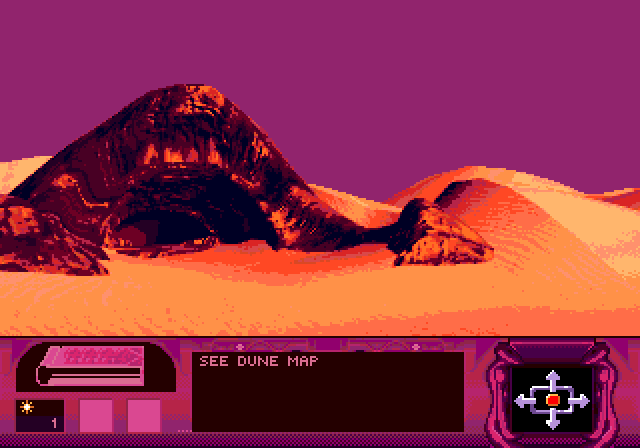 | 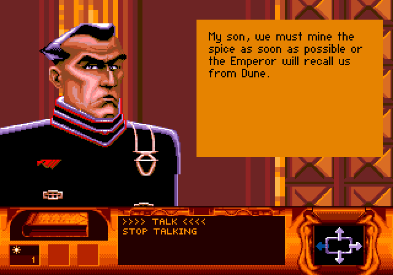 |
| Sega CD: arriving after travel on the map | Sega CD: Duke Leto speaking |
| 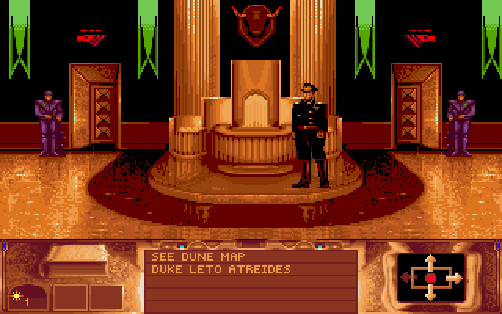 | 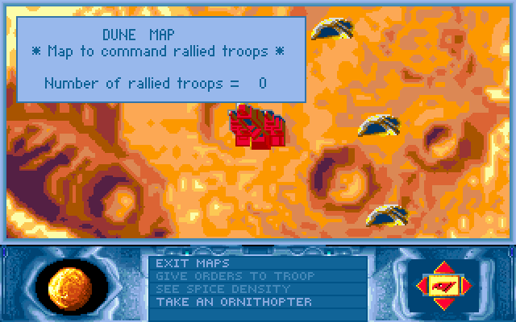 |
| Amiga: the throne room | Amiga: the flat map |
| 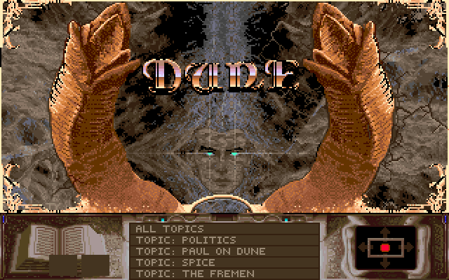 | 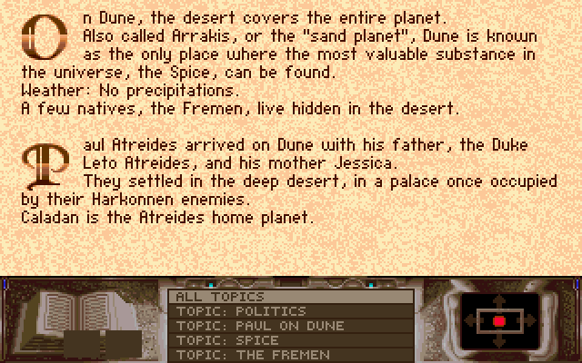 |
| Amiga: Paul's book | Amiga: a page of the book |
| 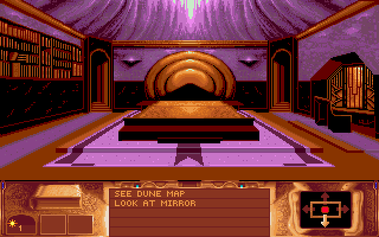 | 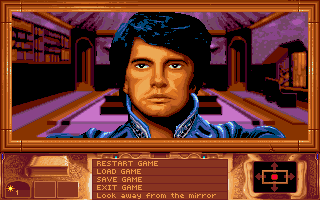 |
| Amiga: Paul's bedroom | Amiga: the mirror |
| 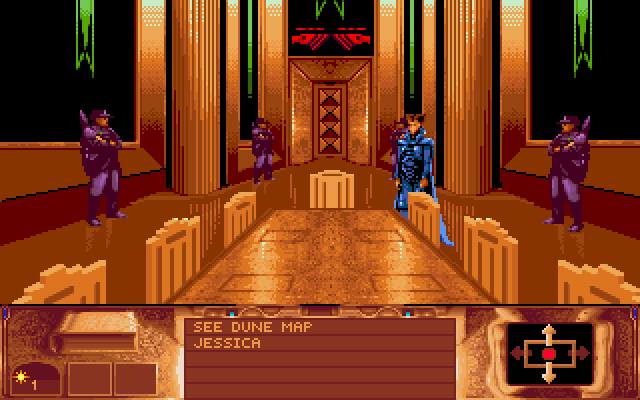 | 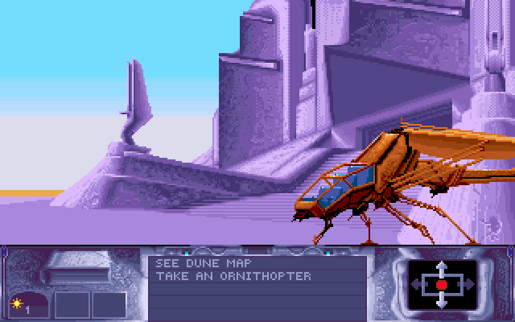 |
| Amiga: a palace hall | Amiga: the palace front |

</div>

## Roadmap

### Soundtrack preservation

Stéphane Picq, the original composer, made the *Dune Spice Opera 2024 remaster*
with Philippe Ulrich. It is available in high-quality formats from
[the official Bandcamp release](https://stphanepicq.bandcamp.com/album/dune-spice-opera-2024-remaster-lp).
The next audio goal is optional support for music the user supplies. It must
respect the release's licensing and keep the original timing and platform
differences. The repository will not bundle the commercial audio.

### Other releases

- **Amiga:** the intro, the Amiga music and sound, and the desert landscape
  for walks and flights.
- **Sega CD / Mega CD:** the verbs, the videos, sound, flight and battles; test
  the European Mega CD release.
- **DOS gameplay:** the remaining room commands. The DOS version then serves as the
  reference behaviour for the other ports.


## Contributing

Contributions are very welcome. Useful help includes:

- decoding the remaining executable tables, scene scripts, and story logic;
- testing CD and floppy data sets on desktop, iOS, and other ScummVM targets;
- validating palette, sprite, room, HNM, and audio behaviour against original
  hardware or trusted recordings;
- completing the Amiga and Sega CD ports (see the roadmap);
- helping design a legally safe optional soundtrack import; and
- improving documentation, tests, tooling, and reproducible builds.

Please open an issue before large changes, include the exact release and data
hashes you tested, and never attach copyrighted game data. Start with
[`CONTRIBUTING.md`](CONTRIBUTING.md), the engine's
[`README.md`](third_party/scummvm/engines/dune/README.md) (architecture and
conventions), its [`CREDITS.md`](third_party/scummvm/engines/dune/CREDITS.md),
and the [ScummVM engine proposal](docs/scummvm-engine-proposal.md).

## Project layout

```text
third_party/scummvm/engines/dune/   the ScummVM engine (drop into scummvm/engines/)
scripts/                            build, screenshot, audio and iOS scripts; resource tools
scripts/patches/                    small ScummVM patches for the iOS backend
tests/regression/                   scripted-input scenarios and checkpoint manifest
Makefile                            make verify / init-golden / add-missing-golden / ipa
BUILDING.md                         how to build and test
doc/                                screenshots and README media
docs/                               ScummVM proposal and project notes
notes/research/gameplay-rules.md    game rules recovered from the executable
notes/speedrun/                     the speedrun route and the battle/worm rules
```

## Legal and licensing

- The **engine** (`third_party/scummvm/engines/dune/`) is licensed under the
  **GNU General Public License, version 3 or (at your option) any later
  version**, like ScummVM itself: see
  [`engines/dune/COPYING`](third_party/scummvm/engines/dune/COPYING). It
  contains code derived from GPL and LGPL projects; every source and its
  licence is listed in [`CREDITS.md`](third_party/scummvm/engines/dune/CREDITS.md).
- The build scripts, tools and documentation outside the engine directory
  remain under the [Apache License 2.0](LICENSE) (see [`NOTICE`](NOTICE)).
- The ScummVM patches in `scripts/patches/` modify ScummVM and are GPL-3.0-or-later
  like the code they patch.

*Dune* and its original assets are copyright their respective rights holders.
This is an independent preservation and research project. It is not affiliated
with or endorsed by Cryo Interactive, Virgin, Stéphane Picq, Philippe Ulrich,
or the ScummVM project.
