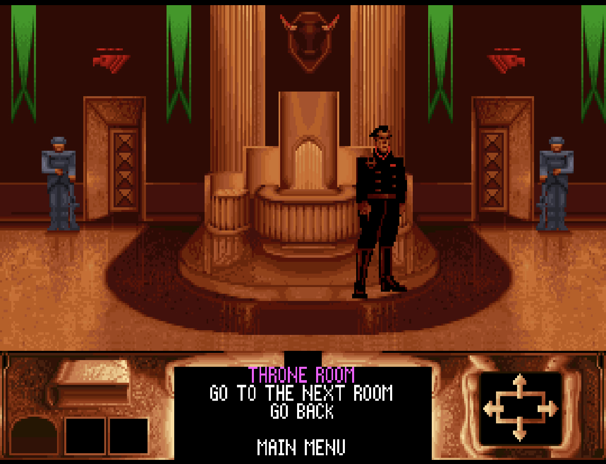
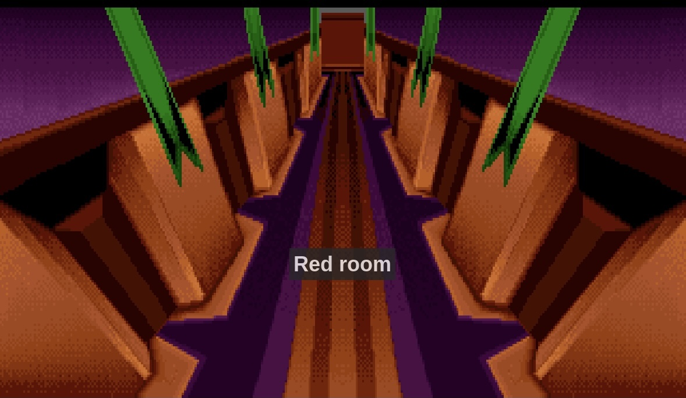

[](https://github.com/OpenRakis/Cryogenic/actions/workflows/pr-validation.yml)
[](LICENSE)

# Desert Frost Spice
**currently only Engine ;)**

<div align="center">


</div>

## Rebuilding Cryo's *Dune* (1992)

Desert Frost engine is a new native [ScummVM](https://www.scummvm.org/) engine intended to make the game
portable to modern systems, including iOS.

The project works from legally obtained game data. No copyrighted Dune game
executables, archives, music files, or disc images are redistributed here.

<div align="center">


<br>
<em>Native ScummVM desktop dump of the reconstructed opening sequence.</em>

</div>

## Current state of the ScummVM engine

Advanced bring-up: DOS CD and floppy detection, resource decoding, intro video playback, AdLib music, room rendering, panel/touch input, and iOS packages are working. Full game logic, dialogue, saves, and all scenes are still in progress. |

The ScummVM engine currently supports:

- CD and floppy DOS data detection, including `DUNE.DAT`, loose files, and
  HSQ compression.
- 4-bit and 8-bit sprite sheets, transparency, scaling, flipping, palettes,
  rooms, sky rendering, palace exits, and the bottom control panel.
- CD HNM intro videos with VOC audio and a floppy intro reconstruction through
  the DUNE title.
- HERAD AdLib music through ScummVM's OPL emulator on desktop and iOS.
- Original pointer graphics and direct touch input on iPhone.
- Reproducible native, SDL, audio-capture, and iOS build scripts.

The detailed status is maintained in
[`third_party/scummvm/engines/dune/README.md`](third_party/scummvm/engines/dune/README.md)
and the reverse-engineering record is in
[`FINDINGS.md`](third_party/scummvm/engines/dune/FINDINGS.md).

## Screenshots

These are captured from the original-compatible rendering work and the iOS
test device:

<div align="center">

| Palace room on iPhone | Corridor room on iPhone |
| --- | --- |
|  |  |

</div>

You need `DNCDPRG.EXE`. Verify the executable
before running it:

```bash
sha256sum DNCDPRG.EXE
# expected: 5f30aeb84d67cf2e053a83c09c2890f010f2e25ee877ebec58ea15c5b30cfff9
```

### ScummVM engine

The ScummVM work is not yet an end-user release. It is a development build
that needs the original data files supplied separately.

For iOS, the build script stages compilation on the local fast drive and
synchronizes the finished IPA and evidence.

The resulting IPA is ad-hoc signed for development testing. It
does not contain Dune's proprietary game data.

## Roadmap

### Soundtrack preservation

The original composer Stéphane Picq's *Dune Spice Opera 2024 remaster*, made
with Philippe Ulrich, is available from [the official Bandcamp release](https://stphanepicq.bandcamp.com/album/dune-spice-opera-2024-remaster-lp)
in high-quality formats. The next audio goal is an optional, user-supplied
music integration that respects the release's licensing and preserves the
original timing and platform differences. The repository will not bundle the
commercial audio.

### Other releases

- **Amiga:** add ADF file-system access, the Amiga resource variants, 32-colour
  rendering, Amiga music, and release-specific detection. The close relation
  to the DOS floppy data makes this a promising next port.
- **Sega Mega CD:** identify the boot/index format in the ISO, then add a
  release-specific resource layer, video handling, CD audio, and detection.
- **DOS gameplay:** complete characters, commands, dialogue, map flow, game
  clock, saves, the remaining intro scenes, and location scripts before using
  the DOS implementation as the shared behavioural reference.

Amiga and Sega Mega CD are research targets, not supported releases yet.

## Contributing

Contributions are very welcome. Useful help includes:

- decoding the remaining executable tables, scene scripts, dialogue, and save
  formats;
- testing CD and floppy data sets on desktop, iOS, and other ScummVM targets;
- validating palette, sprite, room, HNM, and audio behaviour against original
  hardware or trusted recordings;
- researching the Amiga and Sega Mega CD formats;
- helping design a legally safe optional soundtrack import; and
- improving documentation, tests, tooling, and reproducible builds.

Please open an issue before large changes, include the exact release and data
hashes you tested, and never attach copyrighted game data. Start with
[`CONTRIBUTING.md`](CONTRIBUTING.md), the engine's
[`CREDITS.md`](third_party/scummvm/engines/dune/CREDITS.md), and the
[ScummVM engine proposal](docs/scummvm-engine-proposal.md).

If you have an Amiga disk image, Mega CD dump, soundtrack-format knowledge,
original-hardware observations, or a working ScummVM port, please open an
issue or pull request. Contributors who can help turn the current bring-up
into a complete, upstream-quality engine are especially welcome.

## Project layout

```text
third_party/scummvm/engines/dune/      native ScummVM Dune engine
third_party/dune-revival-reference/    preserved reverse-engineering references
doc/                                   project screenshots and README media
docs/scummvm-engine-proposal.md        draft for the ScummVM developers/wiki
docs/DOWNLOADER_BUILD.md               local dependency/download procedure
```

## Legal and licensing

Cryogenic source code is available under the [Apache License 2.0](LICENSE).
The ScummVM components retain the licensing terms required by ScummVM; see
their source headers and `third_party/scummvm/COPYING`.

*Dune* and its original assets are copyright their respective rights holders.
Cryogenic is an independent preservation and research project and is not
affiliated with or endorsed by Cryo Interactive, Virgin, Stéphane Picq,
Philippe Ulrich, or the ScummVM project.
